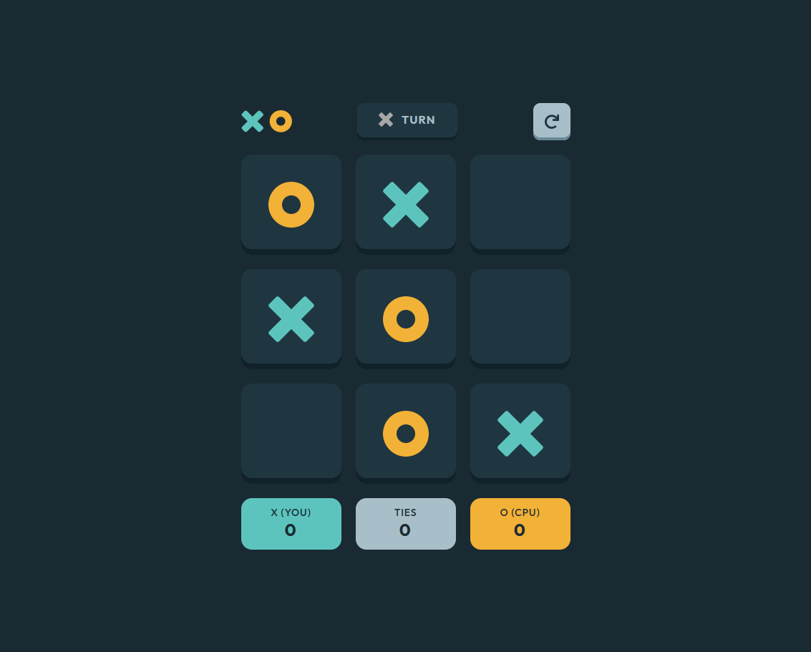

# Frontend Mentor - Tic Tac Toe solution

This is a solution to the [Tic Tac Toe challenge on Frontend Mentor](https://www.frontendmentor.io/challenges/tic-tac-toe-game-Re7ZF_E2v).

## Table of contents

- [Overview](#overview)
  - [The challenge](#the-challenge)
  - [Screenshot](#screenshot)
  - [Links](#links)
- [My process](#my-process)
  - [Built with](#built-with)
  - [Useful resources](#useful-resources)
- [Author](#author)

## Overview

### The challenge

Users should be able to:

- View the optimal layout for the game depending on their device's screen size
- See hover states for all interactive elements on the page
- Play the game either solo vs the computer or multiplayer against another person

### Screenshot

### Links

- Solution URL: [here](https://github.com/kxrn0/Tic-tac-toe-game)
- Live Site URL: [there](https://kxrn0.github.io/Tic-tac-toe-game/dist/)

## My process

### Built with

- Semantic HTML5 markup
- CSS custom properties
- Flexbox
- CSS Grid
- Mobile-first workflow

### Useful resources

- [minimax algorithm video explanation](https://www.youtube.com/watch?v=P2TcQ3h0ipQ&t=2653s) - This helped me understand the minimax algorithm.

## Author

- Frontend Mentor - [@kxrn0](https://www.frontendmentor.io/profile/yourusername)
- Twitter - [@_by_me_0x177](https://www.twitter.com/_by_me_0x177)